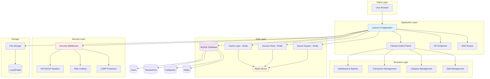
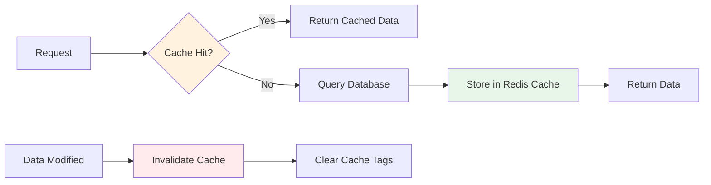
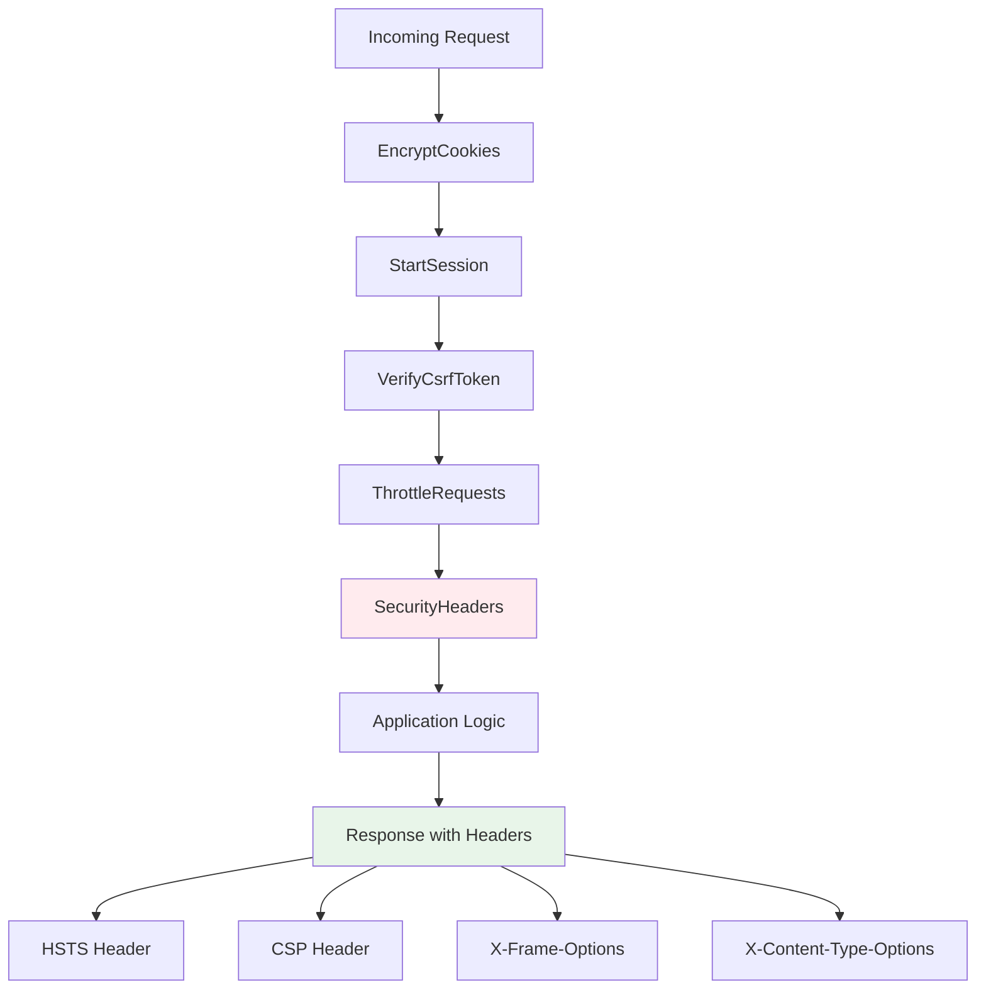

# FinanSphere

**FinanSphere** adalah aplikasi manajemen keuangan pribadi tingkat enterprise yang powerful dan user-friendly. Dibangun dengan Laravel 12, Filament 3, Redis untuk performa maksimal, dan dilengkapi keamanan tingkat tinggi.


<div align="center">

[](https://laravel.com) [](https://php.net) [](https://mysql.com)  
[](https://redis.io) [](https://filamentphp.com) [](https://securityheaders.com)

</div>

---

## 📑 Table of Contents

-   [✨ Fitur Utama](#-fitur-utama)
-   [🏗️ Arsitektur](#️-arsitektur)
-   [🚀 Teknologi Stack](#-teknologi-stack)
-   [⚡ Quick Start](#-quick-start)
-   [📦 Instalasi Lengkap](#-instalasi-lengkap)
-   [🔧 Konfigurasi](#-konfigurasi)
-   [🔐 Security Features](#-security-features)
-   [⚡ Performance Optimization](#-performance-optimization)
-   [💻 Development](#-development)
-   [🚀 Production Deployment](#-production-deployment)
-   [🧪 Testing](#-testing)
-   [🐛 Troubleshooting](#-troubleshooting)
-   [📚 API & Usage](#-api--usage)
-   [🤝 Contributing](#-contributing)

---

## ✨ Fitur Utama

### 💰 Manajemen Keuangan Komprehensif

-   ✅ Pencatatan transaksi pemasukan dan pengeluaran
-   ✅ Kategorisasi transaksi otomatis
-   ✅ Pelacakan hutang dan piutang
-   ✅ Budget planning dan monitoring
-   ✅ Cache-optimized queries untuk performa maksimal

### 📊 Dashboard & Analytics

-   ✅ Dashboard interaktif dengan visualisasi real-time
-   ✅ Grafik dan chart keuangan informatif
-   ✅ Laporan keuangan bulanan/tahunan
-   ✅ Real-time statistics dengan Redis caching
-   ✅ Database notifications dengan polling

### 🔒 Keamanan Tingkat Enterprise

-   ✅ Security Headers (HSTS, CSP, X-Frame-Options)
-   ✅ Session encryption dengan Redis
-   ✅ Rate limiting (60 requests/minute)
-   ✅ Proteksi SQL Injection, XSS, CSRF
-   ✅ Admin panel path obfuscation
-   ✅ Automatic cache invalidation

### ⚡ Performance Optimization

-   ✅ Redis untuk Cache, Session, dan Queue
-   ✅ Model-level caching dengan cache tagging
-   ✅ Slow query detection dan logging
-   ✅ Lazy loading prevention
-   ✅ Database query optimization
-   ✅ Production-ready optimizations

---

## 🏗️ Arsitektur

### System Architecture



### Cache Strategy Flow



### Security Headers Pipeline



---

## 🚀 Teknologi Stack

| Komponen        | Teknologi      | Versi | Deskripsi            |
| --------------- | -------------- | ----- | -------------------- |
| **Backend**     | Laravel        | 12.x  | PHP framework modern |
| **Admin Panel** | Filament       | 3.x   | Panel admin elegan   |
| **Database**    | MySQL          | 8.0+  | Database relasional  |
| **Cache**       | Redis          | 6.0+  | In-memory cache      |
| **Session**     | Redis          | 6.0+  | Session storage      |
| **Queue**       | Redis          | 6.0+  | Job processing       |
| **Language**    | PHP            | 8.4+  | Server-side language |
| **Frontend**    | Blade/Tailwind | -     | Template & CSS       |
| **Security**    | Custom         | -     | Enterprise-level     |

---

## ⚡ Quick Start

### Menggunakan Setup Script (Recommended)

```bash
# Clone repository
git clone https://github.com/Halfirzzha/FinanSphere.git
cd FinanSphere

# Jalankan setup script
chmod +x setup.sh
./setup.sh

# Start development server
php artisan serve
```

### Manual Quick Setup

```bash
# 1. Install dependencies
composer install

# 2. Setup environment
cp .env.example .env
php artisan key:generate

# 3. Configure database di .env
# DB_DATABASE=db_finbrain
# DB_USERNAME=root
# DB_PASSWORD=

# 4. Migrate database
php artisan migrate

# 5. Start Redis
brew services start redis  # macOS
# sudo systemctl start redis-server  # Linux

# 6. Clear caches
php artisan config:clear
php artisan cache:clear

# 7. Start server
php artisan serve
```

### Akses Aplikasi

```
Main URL: http://localhost:8000
Admin Panel: http://localhost:8000/secure-management-panel-xyz123
```

---

## 📦 Instalasi Lengkap

### Prerequisites

Pastikan sistem Anda memiliki:

-   **PHP** 8.4 or higher
-   **Composer** 2.x
-   **MySQL** 8.0 or higher
-   **Redis** 6.0 or higher
-   **Node.js** 18.x or higher
-   **Git** 2.x

### Install Redis

**macOS:**

```bash
brew install redis
brew services start redis
```

**Ubuntu/Debian:**

```bash
sudo apt update
sudo apt install redis-server
sudo systemctl start redis-server
sudo systemctl enable redis-server
```

**Verify Redis:**

```bash
redis-cli ping  # Should return: PONG
```

### Install PHP Redis Extension

**macOS:**

```bash
pecl install redis
```

**Ubuntu:**

```bash
sudo apt install php-redis
```

Tambahkan ke `php.ini`:

```ini
extension=redis.so
```

Restart PHP:

```bash
# PHP-FPM
sudo service php8.4-fpm restart

# atau restart web server
sudo service nginx restart
```

### Langkah Instalasi Detail

```bash
# 1. Clone repository
git clone https://github.com/Halfirzzha/FinanSphere.git
cd FinanSphere

# 2. Install Composer dependencies
composer install --optimize-autoloader

# 3. Install NPM dependencies
npm install

# 4. Setup environment
cp .env.example .env

# 5. Generate application key
php artisan key:generate

# 6. Configure .env file
# Edit database, Redis, dan app settings

# 7. Create database
# mysql -u root -p
# CREATE DATABASE db_finbrain;

# 8. Run migrations
php artisan migrate

# 9. Create storage link
php artisan storage:link

# 10. Build assets (production)
npm run build
# atau untuk development
npm run dev

# 11. Cache configurations
php artisan config:cache
php artisan route:cache
php artisan view:cache

# 12. Create admin user

## Option 1: Custom command dengan full information (Recommended)
php artisan make:filament-admin

## Option 2: Filament standard command (auto-generates username & full_name)
php artisan make:filament-user
```

**Note**: Jika menggunakan `make:filament-user`, system akan otomatis:

-   Generate `username` dari email (sebelum @)
-   Generate `full_name` dari name yang diinput
-   Generate UUID otomatis
-   Set `registered_by` = 'self'

---

## 🔧 Konfigurasi

### Environment Configuration

#### Development (.env)

```env
APP_NAME="FinanSphere"
APP_ENV=local
APP_DEBUG=true
APP_URL=http://localhost:8000

DB_CONNECTION=mysql
DB_HOST=127.0.0.1
DB_PORT=3306
DB_DATABASE=db_finbrain
DB_USERNAME=root
DB_PASSWORD=

# Redis Configuration
REDIS_CLIENT=phpredis
REDIS_HOST=127.0.0.1
REDIS_PASSWORD=null
REDIS_PORT=6379
REDIS_DB=0
REDIS_CACHE_DB=1
REDIS_SESSION_DB=2
REDIS_QUEUE_DB=3
REDIS_PREFIX="FinanSphere_"

# Cache & Session
CACHE_STORE=redis
SESSION_DRIVER=redis
SESSION_ENCRYPT=true
QUEUE_CONNECTION=redis
```

#### Production (.env)

```env
APP_ENV=production
APP_DEBUG=false
APP_URL=https://yourdomain.com

# Enable HTTPS
FORCE_HTTPS=true

# Redis with password
REDIS_PASSWORD=your_strong_password

# Stricter security
SESSION_LIFETIME=60
SESSION_ENCRYPT=true
```

---

## 🔐 Security Features

### Implemented Security Measures

#### 1. Security Headers

Semua response memiliki security headers:

```http
Strict-Transport-Security: max-age=31536000; includeSubDomains; preload
X-Frame-Options: DENY
X-Content-Type-Options: nosniff
X-XSS-Protection: 1; mode=block
Content-Security-Policy: default-src 'self'; script-src 'self' 'unsafe-inline'...
Referrer-Policy: strict-origin-when-cross-origin
Permissions-Policy: geolocation=(), microphone=(), camera=()
```

#### 2. Admin Panel Security

-   **Path Obfuscation**: `/secure-management-panel-xyz123`
-   **Rate Limiting**: 60 requests/minute
-   **Session Encryption**: Enabled
-   **CSRF Protection**: Active

#### 3. Data Protection

-   **Database Encryption**: Sensitive data encrypted
-   **Session Storage**: Redis with encryption
-   **Password Hashing**: Bcrypt (12 rounds)
-   **API Tokens**: Sanctum tokens

### Security Best Practices

```bash
# 1. Always use HTTPS in production
# 2. Set strong Redis password
REDIS_PASSWORD=your_very_strong_password_here

# 3. Rotate application key regularly
php artisan key:generate

# 4. Keep dependencies updated
composer update
npm update

# 5. Monitor logs
tail -f storage/logs/laravel.log

# 6. Regular security audits
composer audit
npm audit
```

---

## ⚡ Performance Optimization

### Redis Integration

FinanSphere menggunakan Redis untuk:

1. **Cache** - Database query caching (DB 1)
2. **Session** - User session storage (DB 2)
3. **Queue** - Background job processing (DB 3)

### Performance Metrics

| Metric         | Before   | After         | Improvement         |
| -------------- | -------- | ------------- | ------------------- |
| Page Load      | Baseline | 50-80% faster | 🚀                  |
| API Response   | Baseline | 60-90% faster | 🚀                  |
| DB Queries     | 100%     | 5-30%         | ⚡ 70-95% reduction |
| Security Score | B/C      | A+            | 🔒                  |

### Model Caching Usage

```php
// Transaction statistics (cached)
$stats = Transaction::getCachedStats();
/*
Returns:
[
    'total_expenses' => 1000000,
    'total_incomes' => 2000000,
    'total_count' => 150,
    'expenses_count' => 80,
    'incomes_count' => 70
]
*/

// Category lists (cached)
$categories = Category::getCached();
$expenseCategories = Category::getExpenseCategories();
$incomeCategories = Category::getIncomeCategories();

// Cache auto-clears when data changes
```

### Optimization Commands

```bash
# Production optimization
composer optimize
# atau
./optimize.sh

# Clear all caches
composer clear
# atau
./dev-reset.sh

# Check cache status
composer check-status
# atau
php artisan cache:status
```

---

## 🔐 Advanced Authentication System (100% Filament)

FinanSphere menggunakan sistem autentikasi Filament yang telah di-customize untuk memberikan pengalaman yang professional, aman, dan user-friendly.

### 🚀 Features

#### Login System

-   ✅ **Login with Username or Email**: User dapat login menggunakan username ATAU email
-   ✅ **Rate Limiting**: Maximum 5 login attempts per menit per IP
-   ✅ **Auto-lock Account**: Account otomatis lock setelah 10 failed attempts
-   ✅ **Activity Logging**: Semua login attempts (success & failed) tercatat
-   ✅ **Remember Me**: Option untuk stay logged in
-   ✅ **Browser Detection**: Track browser, version, platform yang digunakan
-   ✅ **IP Tracking**: Private & Public IP address logging

#### Registration System

-   ✅ **Complete Profile Form**: Username, email, full name, phone, birth date
-   ✅ **Avatar Upload**: Support upload profile picture dengan image editor
    -   Max 2MB
    -   Formats: JPG, PNG, WebP
    -   Dimensions: 100x100 to 2000x2000 pixels
    -   Built-in image editor dengan crop 1:1 aspect ratio
-   ✅ **Strong Password Validation**:
    -   Minimum 8 characters
    -   Mixed case (uppercase & lowercase)
    -   Numbers required
    -   Symbols required
    -   Check against compromised passwords database
-   ✅ **Advanced Validation**:
    -   Username: 3-50 chars, alphanumeric + hyphens/underscores
    -   Email: Valid format + unique check
    -   Phone: International format validation
    -   Birth Date: Must be 13+ years old
-   ✅ **Auto-generation**: UUID dan default values otomatis
-   ✅ **Activity Logging**: Registration activity tercatat lengkap

#### Profile Management

-   ✅ **Edit Profile**: Complete profile editing dengan avatar update
-   ✅ **Change Password**: With strength validation
-   ✅ **Update Personal Info**: Full name, phone, birth date
-   ✅ **Avatar Management**: Upload, crop, atau delete avatar
-   ✅ **Email Change**: With re-verification required
-   ✅ **Activity Tracking**: Semua perubahan tercatat

#### Security Features

-   ✅ **Email Verification**: Required setelah registration
-   ✅ **Password Reset**: Secure password reset via email
-   ✅ **CSRF Protection**: Built-in Filament CSRF protection
-   ✅ **Session Security**: Encrypted sessions dengan Redis
-   ✅ **Rate Limiting**: Pada semua auth endpoints
-   ✅ **Security Headers**: HSTS, CSP, X-Frame-Options, dll
-   ✅ **SQL Injection Prevention**: Parameterized queries
-   ✅ **XSS Protection**: Input sanitization

### 📋 Usage Guide

#### For Users

**Registration:**

```
1. Navigate to: http://localhost:8000/secure-management-panel-xyz123/register
2. Fill form lengkap:
   - Username (unique, 3-50 chars)
   - Email (valid format)
   - Password (strong password required)
   - Full Name
   - Phone Number (optional)
   - Birth Date (optional, 3 ways: day/month/year OR date picker)
   - Avatar (optional, max 2MB)
3. Submit → Email verification sent
4. Click verification link di email
5. Login dengan username atau email
```

**Login:**

```
1. Navigate to: http://localhost:8000/secure-management-panel-xyz123/login
2. Enter:
   - Username OR Email (both accepted)
   - Password
   - Check "Remember me" (optional)
3. Click "Sign in"
4. Redirected to dashboard
```

**Profile Editing:**

```
1. Click avatar/name di top right
2. Select "Profile"
3. Update:
   - Avatar (click to upload/crop)
   - Email (requires re-verification)
   - Full Name
   - Phone Number
   - Birth Date
   - Password (optional)
4. Click "Save changes"
```

#### For Developers

**Custom Login Page:**

```php
// app/Filament/Pages/Auth/Login.php
// Supports username OR email login
protected function getCredentialsFromFormData(array $data): array
{
    $login = $data['login'];
    $loginType = filter_var($login, FILTER_VALIDATE_EMAIL) ? 'email' : 'username';

    return [
        $loginType => $login,
        'password' => $data['password'],
    ];
}
```

**Custom Registration Page:**

```php
// app/Filament/Pages/Auth/Register.php
// Full featured registration dengan:
// - Avatar upload dengan image editor
// - Advanced validation
// - Activity logging
// - Auto-generation UUID
```

**Security Middleware:**

```php
// Rate limiting automatically applied
// Located in: app/Http/Middleware/LoginRateLimiter.php
// 5 attempts per minute per IP
```

### 🎨 UI/UX Features

#### Login Page

-   Clean, professional design
-   Single input untuk username/email
-   Password reveal toggle
-   Remember me checkbox
-   "Forgot password?" link
-   "Register" link untuk new users
-   Mobile responsive
-   Dark mode support

#### Registration Page

-   Multi-section form:
    1. Account Information
    2. Personal Information
    3. Profile Picture
-   Real-time validation
-   Password strength indicator
-   Drag & drop avatar upload
-   Built-in image editor
-   Progress indication
-   Clear error messages
-   Success notifications

#### Profile Edit Page

-   Sidebar dengan avatar preview
-   Organized sections
-   Inline editing
-   Auto-save indicators
-   Undo capability
-   Change history
-   Activity logs visible

### 🔒 Security Implementation

#### Password Security

```php
// Validation rules
Password::default()
    ->min(8)
    ->mixedCase()
    ->numbers()
    ->symbols()
    ->uncompromised() // Check against haveibeenpwned.com
```

#### Rate Limiting

```php
// LoginRateLimiter middleware
- 5 attempts per minute
- Per IP + email combination
- Auto-clear on successful login
- Customizable throttle window
```

#### File Upload Security

```php
// Avatar upload rules
- Max 2MB size
- Only images: jpg, png, webp
- Dimensions: 100x100 to 2000x2000
- Stored in public/storage/avatars
- Public visibility for display
- Auto cleanup old avatars
```

#### Session Security

```php
// Redis-backed encrypted sessions
'driver' => 'redis',
'lifetime' => 120,
'expire_on_close' => false,
'encrypt' => true,
'secure' => true, // HTTPS only
'http_only' => true,
'same_site' => 'lax',
```

### 📊 Activity Tracking

Semua auth activities terekam di `user_activity_logs`:

```php
// Example activities:
- user_registered
- login (with full device/browser info)
- logout
- password_changed
- profile_updated
- email_verification
- password_reset
- failed_login_attempt
```

**View activity logs:**

```php
$user = Auth::user();

// Recent activities (7 days)
$activities = $user->activityLogs()->recent()->get();

// Today's activities
$today = $user->activityLogs()->today()->get();

// Specific type
$logins = $user->activityLogs()->ofType('login')->get();
```

### 🧪 Testing

**Test Login with Username:**

```bash
# Via tinker
$user = User::first();
// Login at: /secure-management-panel-xyz123/login
// Username: admin
// Password: password
```

**Test Login with Email:**

```bash
// Login at: /secure-management-panel-xyz123/login
// Email: admin@finbrain.com
// Password: password
```

**Test Registration:**

```bash
// Register at: /secure-management-panel-xyz123/register
// Fill all required fields
// Upload avatar (optional)
// Check email for verification link
```

### 🎯 Best Practices

1. **Always use HTTPS in production**
2. **Enable email verification** (already configured)
3. **Monitor failed login attempts**
4. **Regular password rotation** (encourage users)
5. **Keep rate limits** (prevent brute force)
6. **Validate all uploads** (already implemented)
7. **Log all activities** (already implemented)
8. **Use strong passwords** (enforced)

### 📱 Mobile Support

-   ✅ Fully responsive design
-   ✅ Touch-friendly inputs
-   ✅ Mobile image upload
-   ✅ Native date pickers
-   ✅ Optimized for small screens
-   ✅ Fast loading times

---

## 👤 Advanced User Management System

### User Table Schema

FinanSphere memiliki sistem manajemen user yang sangat lengkap dan profesional dengan fitur-fitur enterprise:

#### User Identity & Authentication

-   **UUID**: Unique identifier untuk setiap user
-   **Username**: Username unik untuk login
-   **Full Name**: Nama lengkap user
-   **Email**: Email dengan verifikasi
-   **Phone Number**: Nomor telepon user
-   **Avatar**: Profile picture dengan upload support

#### Birth Information

-   **Birth Day**: Tanggal lahir (1-31)
-   **Birth Month**: Bulan lahir (1-12)
-   **Birth Year**: Tahun lahir
-   **Birth Date**: Full birth date untuk perhitungan umur otomatis

#### Security & Password Management

-   **Password**: Hashed dengan bcrypt
-   **Password Changed At**: Timestamp terakhir ganti password
-   **Password Changed By**: Siapa yang mengubah (system|admin_id|self)
-   **Password Change Count**: Jumlah berapa kali password diganti

#### Registration Tracking

-   **Registered By**: Pendaftaran melalui apa (system|admin|self)
-   **Registered By Admin ID**: Foreign key ke admin yang mendaftarkan
-   **Registration Notes**: Catatan tambahan saat registrasi

#### Advanced Login Tracking

Setiap login dicatat dengan detail lengkap:

-   **Last Login At**: Timestamp login terakhir
-   **Last Login IP Private**: IP private user
-   **Last Login IP Public**: IP public user (diambil dari external service)
-   **Last Login Browser**: Browser yang digunakan (Chrome, Firefox, Safari, dll)
-   **Last Login Browser Version**: Versi browser
-   **Last Login Platform**: Operating system (Windows 10, macOS, Linux, Android, iOS)
-   **Last Login User Agent**: Full user agent string
-   **Total Login Count**: Total berapa kali user login

#### Current Session Tracking

Informasi sesi aktif user saat ini:

-   **Current IP Private**: IP private saat ini
-   **Current IP Public**: IP public saat ini
-   **Current Browser**: Browser yang sedang digunakan
-   **Current Browser Version**: Versi browser saat ini
-   **Current Platform**: Platform yang digunakan
-   **Current User Agent**: User agent saat ini

#### Account Status

-   **Is Active**: Status aktif/nonaktif
-   **Is Locked**: Status locked/unlocked
-   **Locked At**: Kapan di-lock
-   **Locked By**: Siapa yang melakukan lock
-   **Locked Reason**: Alasan di-lock

### User Activity Logs

Setiap aktivitas user dicatat secara detail dalam tabel `user_activity_logs`:

#### Activity Information

-   **Activity Type**: Jenis aktivitas (login, logout, password_change, profile_update, dll)
-   **Activity Description**: Deskripsi aktivitas
-   **Activity Data**: Metadata tambahan dalam format JSON

#### Request Tracking

-   **IP Address Private**: IP private saat aktivitas
-   **IP Address Public**: IP public saat aktivitas
-   **Browser**: Browser yang digunakan
-   **Browser Version**: Versi browser
-   **Platform**: Operating system
-   **User Agent**: Full user agent string
-   **Method**: HTTP method (GET, POST, PUT, DELETE)
-   **URL**: Full URL yang diakses
-   **Referrer**: URL referrer
-   **Status Code**: HTTP status code response
-   **Session ID**: ID session saat aktivitas

### User Model Features

#### Auto-UUID Generation

```php
// UUID otomatis generate saat user dibuat
$user = User::create([
    'username' => 'johndoe',
    'full_name' => 'John Doe',
    'email' => 'john@example.com',
    'password' => bcrypt('password'),
]);
// $user->uuid akan otomatis ter-generate
```

#### Login Tracking

```php
// Update login information otomatis
$user->updateLoginInfo();
// Akan update semua field login dan increment total_login_count
```

#### Activity Logging

```php
// Log aktivitas user
$user->logActivity('profile_update', 'User updated profile information', [
    'changed_fields' => ['email', 'phone_number']
]);

// Log otomatis mencatat:
// - IP address (private & public)
// - Browser dan versi
// - Platform/OS
// - URL, method, referrer
// - Session ID
```

#### Browser & Platform Detection

```php
// Otomatis detect browser
$user->getBrowserName(); // "Google Chrome", "Mozilla Firefox", "Safari", dll

// Detect browser version
$user->getBrowserVersion(); // "120.0.6099.109"

// Detect platform/OS
$user->getPlatform(); // "Windows 10/11", "macOS", "Linux", "Android", "iOS"
```

#### Public IP Detection

```php
// Get public IP dengan multiple fallback services
$user->getPublicIp();
// Try services: ipify.org, my-ip.io, ipapi.co
// Fallback to header checks if services fail
```

#### Scopes & Helpers

```php
// Get active users
User::active()->get();

// Get locked users
User::locked()->get();

// Check if logged in today
if ($user->hasLoggedInToday()) {
    // User sudah login hari ini
}

// Get user age
$age = $user->age; // Calculate from birth_date
```

### User Observer

Sistem memiliki Observer yang otomatis log setiap perubahan:

```php
// Saat user dibuat
UserObserver::created() → Log "user_created"

// Saat profile diupdate
UserObserver::updated() → Log "profile_updated"

// Saat password diubah
UserObserver::updated() → Log "password_changed"

// Saat account di-lock/unlock
UserObserver::updated() → Log "account_locked" / "account_unlocked"

// Saat user dihapus
UserObserver::deleted() → Log "user_deleted"

// Saat user direstore
UserObserver::restored() → Log "user_restored"
```

### Authentication Events

Listener otomatis handle authentication events:

```php
// Login Event
Login → Update login info, log activity

// Logout Event
Logout → Log activity

// Failed Login Event
Failed → Log warning ke Laravel log

// Password Reset Event
PasswordReset → Update password_changed_at, increment counter
```

### TrackUserActivity Middleware

Middleware otomatis update current session info setiap request:

```php
// Di setiap request authenticated user:
// - Update current_ip_private
// - Update current_ip_public
// - Update current_browser
// - Update current_browser_version
// - Update current_platform
// - Update current_user_agent
```

### Database Indexes

Semua field penting ter-index untuk performa optimal:

-   uuid, username, email, phone_number
-   registered_by, last_login_at
-   is_active, is_locked
-   birth_date
-   created_at, updated_at
-   Activity logs: user_id, activity_type, created_at, session_id

### Usage Examples

#### Create User with Full Information

```php
$user = User::create([
    'username' => 'johndoe',
    'full_name' => 'John Doe',
    'email' => 'john@example.com',
    'password' => bcrypt('password'),
    'phone_number' => '+1234567890',
    'birth_date' => '1990-06-15',
    'registered_by' => 'admin',
    'registered_by_admin_id' => 1,
    'registration_notes' => 'VIP customer',
]);
```

#### Get User Activity Logs

```php
// Get all activities
$activities = $user->activityLogs;

// Get recent activities (last 7 days)
$recentActivities = $user->activityLogs()->recent()->get();

// Get today's activities
$todayActivities = $user->activityLogs()->today()->get();

// Get specific activity type
$loginLogs = $user->activityLogs()->ofType('login')->get();
```

#### Lock/Unlock User

```php
// Lock user
$user->update([
    'is_locked' => true,
    'locked_at' => now(),
    'locked_by' => 'admin',
    'locked_reason' => 'Suspicious activity detected',
]);

// Unlock user
$user->update([
    'is_locked' => false,
    'locked_at' => null,
    'locked_by' => null,
    'locked_reason' => null,
]);
```

### Security Features

1. **IP Tracking**: Private dan Public IP dicatat untuk keamanan
2. **Browser Fingerprinting**: Detect browser dan version
3. **Platform Detection**: Track OS yang digunakan
4. **Session Tracking**: Full session monitoring
5. **Activity Logging**: Semua aktivitas tercatat
6. **Password History**: Track password changes
7. **Account Locking**: Lock mechanism dengan reason
8. **Failed Login Detection**: Log failed login attempts

### Performance Optimization

-   Indexes pada semua field yang sering di-query
-   Efficient relationship queries
-   Minimal overhead pada request
-   Cached browser/platform detection
-   Fallback mechanisms untuk external services

---

## 💻 Development

### Composer Scripts

```bash
# Start development (all services)
composer dev

# Optimize for production
composer optimize

# Clear all caches
composer clear

# Fresh database
composer fresh

# Check Redis/cache status
composer check-status
```

### Shell Scripts

```bash
# Quick setup
./setup.sh

# Production optimization
./optimize.sh

# Development reset
./dev-reset.sh
```

### Artisan Commands

```bash
# Custom commands
php artisan cache:status        # Check Redis & cache status

# Standard Laravel
php artisan serve               # Start dev server
php artisan migrate             # Run migrations
php artisan db:seed             # Seed database
php artisan queue:work redis    # Start queue worker
php artisan tinker              # Interactive shell
```

### Development Workflow

```bash
# Terminal 1: Laravel server
php artisan serve

# Terminal 2: Vite (asset compilation)
npm run dev

# Terminal 3: Queue worker (optional)
php artisan queue:work redis

# Terminal 4: Log monitoring
tail -f storage/logs/laravel.log
```

---

## 🚀 Production Deployment

### Deployment Checklist

-   [ ] Set `APP_ENV=production`
-   [ ] Set `APP_DEBUG=false`
-   [ ] Generate `APP_KEY`
-   [ ] Configure HTTPS/SSL
-   [ ] Set Redis password
-   [ ] Update database credentials
-   [ ] Run optimizations
-   [ ] Setup queue worker
-   [ ] Configure cron jobs
-   [ ] Setup monitoring
-   [ ] Configure backups

### Deployment Steps

```bash
# 1. Clone and install
git clone https://github.com/Halfirzzha/FinanSphere.git
cd FinanSphere
composer install --no-dev --optimize-autoloader
npm install && npm run build

# 2. Configure environment
cp .env.example .env
# Edit .env for production

# 3. Generate keys and optimize
php artisan key:generate
php artisan config:cache
php artisan route:cache
php artisan view:cache
php artisan filament:optimize

# 4. Migrate database
php artisan migrate --force

# 5. Set permissions
chmod -R 755 storage bootstrap/cache
chown -R www-data:www-data storage bootstrap/cache

# 6. Setup supervisor for queue
# Create: /etc/supervisor/conf.d/finansphere-worker.conf
```

### Supervisor Configuration

```ini
[program:finansphere-worker]
process_name=%(program_name)s_%(process_num)02d
command=php /path/to/FinanSphere/artisan queue:work redis --sleep=3 --tries=3
autostart=true
autorestart=true
user=www-data
numprocs=2
redirect_stderr=true
stdout_logfile=/path/to/FinanSphere/storage/logs/worker.log
```

### Nginx Configuration

```nginx
server {
    listen 80;
    server_name yourdomain.com;
    return 301 https://$server_name$request_uri;
}

server {
    listen 443 ssl http2;
    server_name yourdomain.com;
    root /path/to/FinanSphere/public;

    ssl_certificate /path/to/ssl/cert.pem;
    ssl_certificate_key /path/to/ssl/key.pem;

    add_header X-Frame-Options "DENY";
    add_header X-Content-Type-Options "nosniff";

    index index.php;

    charset utf-8;

    location / {
        try_files $uri $uri/ /index.php?$query_string;
    }

    location = /favicon.ico { access_log off; log_not_found off; }
    location = /robots.txt  { access_log off; log_not_found off; }

    error_page 404 /index.php;

    location ~ \.php$ {
        fastcgi_pass unix:/var/run/php/php8.4-fpm.sock;
        fastcgi_param SCRIPT_FILENAME $realpath_root$fastcgi_script_name;
        include fastcgi_params;
    }

    location ~ /\.(?!well-known).* {
        deny all;
    }
}
```

---

## 🧪 Testing

```bash
# Run all tests
php artisan test

# Run with coverage
php artisan test --coverage

# Run specific test
php artisan test tests/Feature/TransactionTest.php

# Run parallel tests
php artisan test --parallel
```

---

## 🐛 Troubleshooting

### Common Issues

#### Redis Connection Failed

```bash
# Check Redis status
redis-cli ping  # Should return: PONG

# Start Redis
brew services start redis          # macOS
sudo systemctl start redis-server  # Linux

# Check Redis configuration
redis-cli config get requirepass
```

#### Cache Not Working

```bash
# Clear all caches
composer clear

# Verify cache driver
php artisan tinker
>>> config('cache.default')  // Should return: 'redis'
>>> Cache::get('test')
```

#### Permission Errors

```bash
# Fix storage permissions
chmod -R 775 storage bootstrap/cache
chown -R www-data:www-data storage bootstrap/cache
```

#### Migration Errors

```bash
# Check database connection
php artisan tinker
>>> DB::connection()->getPdo()

# Reset migrations (CAUTION: deletes all data)
php artisan migrate:fresh
```

#### Slow Performance

```bash
# Check slow queries
tail -f storage/logs/laravel.log | grep "Slow query"

# Optimize database
php artisan db:show --counts

# Check Redis memory
redis-cli info memory
```

---

## 📚 API & Usage

### Cache API

```php
use Illuminate\Support\Facades\Cache;

// Store with tags
Cache::tags(['transactions'])->put('key', 'value', 3600);

// Retrieve
$value = Cache::tags(['transactions'])->get('key');

// Flush specific tag
Cache::tags(['transactions'])->flush();

// Remember (get or store)
$data = Cache::remember('key', 3600, function() {
    return Model::all();
});
```

### Model Usage

```php
// Transaction with caching
$stats = Transaction::getCachedStats();

// Category with caching
$categories = Category::getCached();
$expenses = Category::getExpenseCategories();
$incomes = Category::getIncomeCategories();
```

---

## 🤝 Contributing

Kontribusi sangat dihargai! Ikuti langkah berikut:

1. Fork repository
2. Create feature branch (`git checkout -b feature/AmazingFeature`)
3. Commit changes (`git commit -m 'Add AmazingFeature'`)
4. Push to branch (`git push origin feature/AmazingFeature`)
5. Open Pull Request

### Coding Standards

-   Follow PSR-12 coding style
-   Add tests for new features
-   Update documentation
-   Keep commits atomic and descriptive

---

## 📄 License

Distributed under the MIT License. See `LICENSE` for more information.

---

## 📞 Support & Contact

-   **Email**: halfirzzha@creativestreesid.com
-   **GitHub**: [@Halfirzzha](https://github.com/Halfirzzha)
-   **Issues**: [GitHub Issues](https://github.com/Halfirzzha/FinanSphere/issues)

---

## 🙏 Credits

**Author**: Halfirzzha  
**Organization**: Creative Trees ID  
**Version**: 2.0.0  
**Last Updated**: November 26, 2025

Built with ❤️ using Laravel, Filament, and Redis.

---

## 📊 Project Status


**Status**: ✅ Active Development  
**Stability**: 🟢 Stable  
**Production Ready**: ✅ Yes
